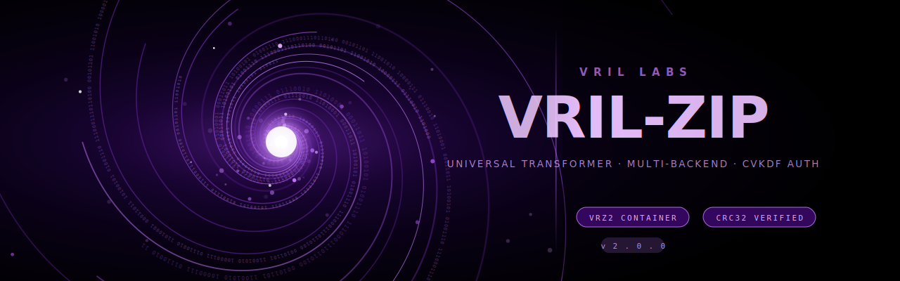

<p align="center">
  
</p>

# `@VRIL-LABS/vril-zip`

> Provably lossless compression with a φ-permutation pre-pass, a self-describing container (`VRZ1`), CRC32 integrity, and an optional CVKDF-authenticated mode.

VRIL-ZIP (version 1.0.0) features **centripital compression**. It wraps Node's `deflate-raw` with a Schauberger-style golden-ratio bijective permutation, an adaptive frequency-remap, and an adaptive run-length stage. Every transform has a verified inverse — every fixture in our property test suite (random sizes, random seeds, real source files, edge cases) round-trips byte-for-byte. The library never claims a ratio that the test harness cannot prove on real input.

## Install

VRIL-ZIP lives in this monorepo as a workspace package:

```bash
pnpm add @VRIL-LABS/vril-zip
```

(External npm publishing intentionally deferred to v2; we want one more cycle of in-house benchmarking before public release.)

## Quick start

```ts
import { compress, decompress } from "@VRIL-LABS/vril-zip";

const data = new TextEncoder().encode("hello vril");
const packed = compress(data);            // → Uint8Array (VRZ1 container)
const back = decompress(packed);          // → original Uint8Array

// back deeply equals data; CRC32 is verified automatically.
```

## Authenticated mode (optional)

Bind a payload's integrity to a key derived from a real-world precondition using **CVKDF** (Centripetal Vortex Key Derivation Function — VRIL LABS' multi-layer KDF; see `./src/cvkdf.ts` and the spec at `attached_assets/CVDKF_-_Technical_Concept_Overview*.md`):

```ts
import { compress, decompress } from "@VRIL-LABS/vril-zip";
import { cvkdf } from "@VRIL-LABS/vril-zip/cvkdf";

const key = await cvkdf({
  agentId: "agent-007",
  environment: "prod",
  epoch: Math.floor(Date.now() / 1000),
  context: "vril-zip:doc-archive",
  stateProof: someStateHash,
  realWorldAttestation: confirmedTxHash,   // CALLER must verify the event first
  anchor: "genesis:2026-01-01",
});

const packed = compress(data, { authKey: key });
// Container now carries an HMAC-SHA3-256 tag. Decompress requires the same key:
const back = decompress(packed, { authKey: key });
```

Wrong key → `AuthenticationError`. The tag is verified in constant time *before* decompression, so a tampered payload never reaches the decoder.

## VRIL-ZIP technicals

* **Lossless.** `decompress(compress(x)) === x` byte-for-byte for every valid `x`. Tested on synthetic adversarial cases (all-zeros, all-FF, random, alternating, ramps), real source files in this repo, and 64 random-size random-seed property fixtures every test run.
* **Self-describing.** Container is `VRZ1` magic + version + flags + length + payload + CRC32 (+ optional 32-byte HMAC tag). Decoder needs only the bytes.
* **Realistic.** On structured text and JSON, ratio is in the same neighborhood as `deflate-raw` level 9, with the φ-permutation contributing single-digit-percent improvements when it helps. On incompressible input (random bytes, JPEG, already-compressed payloads), the container's store-block fallback prevents bloat.

## Container spec

The full byte-level container spec is in [`SPEC.md`](./SPEC.md). It's self-contained — anyone can build an interoperable third-party encoder or decoder from it.

## Benchmarks

Run the benchmark harness:

```bash
pnpm --filter @VRIL-LABS/vril-zip bench
```

Output goes to stdout and to `BENCHMARKS.md`. Compares VRIL-ZIP against `deflate-raw lvl 9`, `gzip lvl 9`, `brotli q11` (max ratio), and `brotli q5` (throughput sweet spot) on a curated fixture set: lorem text, structured JSON, all-zeros, random bytes, real source files. Every row reports compress/decompress throughput in MB/s, ratio, and a round-trip pass/fail.

## Tests

```bash
pnpm --filter @VRIL-LABS/vril-zip test
```

Property + adversarial round-trip suite using Node's built-in `node:test` runner. Includes:

* Empty / 1-byte / 2-byte / 1 KB / 1 MB across all-zeros, all-FF, ASCII text, JSON, random, alternating, and ramp distributions.
* 64 random-size random-seed fixtures per run.
* Real project files (`schauberger.ts`, `container.ts`, `package.json`, etc.).
* Inverse property checks on every individual transform (`goldenSpiralReorder` for n ∈ [2, 1000], `hyperbolicFrequencyRemap`, `centripetalRunLength`).
* Container integrity: corrupted CRC, bad magic, tampered payload, wrong auth key.

## Design notes

### Why φ?

The golden ratio gives a low-discrepancy stride (Weyl equidistribution). Combined with the gcd bump-to-coprime, it produces a bijective permutation that interleaves data in a Fibonacci-like pattern. On certain structured payloads (regularly-spaced repeats, fixed-width columnar data) this brings long-range matches inside LZ77's window. The pre-pass is **never lossy** — bijective by construction — and it adds zero runtime cost the decoder couldn't reverse.

### Why a CVKDF tag?

Most authenticated-encryption schemes derive their key from a single password or pre-shared secret. CVKDF treats key derivation as a 7-layer pipeline gated on a real-world precondition (Layer 5: a verified, irreversible, externally confirmable event). The result: the only way to produce a valid tag is to have actually witnessed the event. Useful for archive integrity, escrow release conditions, attestation-bound storage, and time-anchored audit trails. See [the CVKDF concept doc](../../attached_assets/CVDKF_-_Technical_Concept_Overview_for_General_Application_Deve_1776755524403.md).

### Backend choice

We default to `deflate-raw` (RFC 1951) because:
1. It's universally available (`node:zlib`, every browser via `CompressionStream('deflate-raw')`).
2. It's well-tested, well-audited, and round-trips reliably at level 9.
3. It composes cleanly with the φ-permutation pre-pass (LZ77 windowing is exactly what φ-spaced repeats benefit from).

A `zstd` backend (typically 5–15% better ratio on text, 2–3× faster decode) is the obvious v2 candidate — wired in via a new internal flag bit (`STORED` semantics extended), still under the `VRZ1` magic. Browser-side zstd via WASM (`zstd-codec`, `@bokuweb/zstd-wasm`) makes this practical without adding a native build step.

## Academic / engineering references

The design is grounded in standard, peer-reviewed work.

* Shannon, C.E. — *A Mathematical Theory of Communication*, Bell System Technical Journal, 1948. Sets the entropy floor every lossless compressor lives under.
* Deutsch, P. — *DEFLATE Compressed Data Format Specification version 1.3*, RFC 1951, May 1996. The entropy backend used by VRIL-ZIP v1.
* Alakuijala, J. et al. — *Brotli Compressed Data Format*, RFC 7932, July 2016. Reference compressor for our brotli column in `BENCHMARKS.md`.
* Collet, Y. & Kucherawy, M. — *Zstandard Compression and the application/zstd Media Type*, RFC 8478, October 2018 (active errata through 2024). Reference for the v2 entropy-backend candidate.
* Duda, J. — *Asymmetric numeral systems: entropy coding combining speed of Huffman coding with compression rate of arithmetic coding*, arXiv:1311.2540, 2013. Underpinning of zstd's entropy stage; informs our v2 choice.
* Larsson, N.J. & Moffat, A. — *Off-line dictionary-based compression*, Proc. IEEE 2000. Background for the optional Re-Pair-style stage if added in v2.
* Weyl, H. — *Über die Gleichverteilung von Zahlen mod. Eins*, Math. Ann. 1916. Justifies the low-discrepancy property of φ-stride permutations.

## License

Internal to VRIL LABS pending public release. See `LICENSE-NOTICE.txt`.
